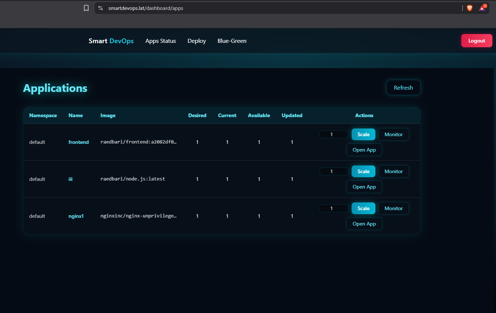
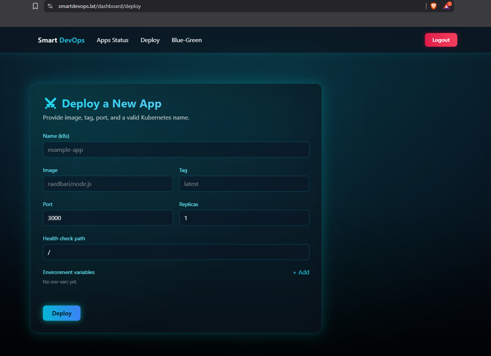

```md
# 🚀 SmartDevOps Platform

A smart and modern platform for deploying and managing **multi-tenant applications** on **Kubernetes**,  
built with **FastAPI**, **Next.js**, and fully integrated **Prometheus · Grafana · Alertmanager** monitoring.

The platform combines **simplicity for clients** and **professional features for DevOps engineers**,  
with strong security, full tenant isolation, and zero-downtime deployments.

---

## 🧠 Overview

**SmartDevOps** automates the entire application lifecycle inside Kubernetes:

- Secure tenant onboarding  
- App deployment (single click)  
- Full monitoring (CPU, memory, logs, events)  
- Blue-Green deployment flow  
- Instant alerts on failures  
- Strict namespace isolation for each tenant  

The system is designed to provide a frictionless experience for beginners  
while giving DevOps users powerful observability and deployment tools.

---

---

# 📚 Table of Contents

- [🧠 Overview](#-overview)
- [💡 Problem & Solution](#-problem--solution)
- [🏗️ Architecture](#️-architecture)
- [⚙️ Technologies](#️-technologies)
- [📸 Screenshots](#-screenshots)
- [📂 Project Structure](#-project-structure)
  - [Backend (FastAPI)](#backend-fastapi)
  - [Frontend (Nextjs)](#frontend-nextjs)
- [🔵 Blue-Green Deployment](#-blue-green-deployment)
- [📊 Monitoring & Alerting](#-monitoring--alerting)
- [🛡 Tenant Isolation](#-tenant-isolation)
- [🔐 Security](#-security)
- [🚀 CI/CD Pipeline](#-cicd-pipeline)
- [👤 About the Developer](#-about-the-developer)

---

## 💡 Problem & Solution

| Problem | SmartDevOps Solution |
|--------|------------------------|
| Slow & unsafe deployments | Blue-Green deployment → zero downtime |
| Rollback complexity | One-click **Rollback** |
| Hard to know when app fails | Alertmanager → instant email alerts |
| No monitoring visibility | Dedicated Grafana dashboards |
| Multi-tenant shared resources | Namespace + RBAC + NetworkPolicy isolation |
| Clients use protected ports <1024 | Auto-rewrite to **8080** (avoid root requirements) |
| Open sign-up is unsafe | Admin approval before activating any tenant |
| Companies need grouped users | Automatic match: if tenant enters namespace name of company → joins it |

---

## 🏗️ Architecture

📘 Full architecture diagram:  
`/docs/architecture.drawio`

Open using **draw.io** or **diagrams.net**.

Contains flows for:

- User signup  
- Tenant approval  
- Login  
- Deploy App  
- App Status  
- Monitoring  
- Alertmanager webhook  
- Blue-Green deployment  
- Namespace RBAC & isolation  

---

## ⚙️ Technologies

| Layer | Stack |
|-------|--------|
| **Frontend** | Next.js, TypeScript, TailwindCSS, Framer Motion |
| **Backend** | FastAPI, SQLAlchemy, PostgreSQL |
| **K8s Layer** | Deployments, Services, Ingress-NGINX |
| **Monitoring** | Prometheus, Grafana, Loki, Alertmanager |
| **Security** | JWT Auth, RBAC, Calico NetworkPolicies, Secrets |
| **CI/CD** | GitHub Actions (auto build, push, deploy) |
| **Deployment Strategy** | Blue-Green Deployment |

---

## 📸 Screenshots

### 🔹 App Status Page


### 🔹 Blue-Green Deployment Panel


### 🔹 Deploy New App


---

## 📂 Project Structure

### 🧩 Backend (FastAPI)

```

app/
├── auth.py                  # JWT login
├── onboarding.py            # Tenant NS + RBAC + Quota setup
├── k8s_ops.py               # Deploy, scale, service, blue-green logic
├── monitor.py               # Metrics, logs, Grafana URL generator
├── alerts/webhook.py        # Alertmanager → backend handler
├── models.py                # SQLAlchemy models
├── db.py                    # DB engine + SessionLocal
├── config.py                # Environment variables
├── k8s_client.py            # Kubernetes client init
└── main.py                  # FastAPI entry

```

---

### 💻 Frontend (Next.js)

```

app/
├── auth/                    # Login, signup, pending approval
├── dashboard/
│   ├── apps/                # Status, monitor, scale, open app
│   ├── deploy/              # Deploy new apps
│   ├── bluegreen/           # Prepare / Promote / Rollback
│   └── admin/tenants/       # Admin approvals
components/                  # UI components + Blue-Green modals
apis/                        # API wrappers
public/                      # Static assets
middleware.ts                # JWT route protection
next.config.ts

````

---

## 🔵 Blue-Green Deployment

SmartDevOps includes a full **zero-downtime deployment** system:

### 1️⃣ Prepare  
User upgrades from `nginx:1.0` → `nginx:2.0`:

- Old version continues running  
- New version created as:  
  `nginx-preview`

### 2️⃣ Promote  
If new version is healthy:

- Switch traffic to `nginx:2.0`  
- Old version stops automatically  

### 3️⃣ Rollback  
If something goes wrong:

- One click → return to previous stable version  

This guarantees **zero downtime**, **safe upgrades**, and **instant rollback**.

---

## 📊 Monitoring & Alerting

### 🔹 Prometheus
Collects metrics:

- CPU (per pod / per namespace)  
- Memory  
- Deployment replicas  
- HTTP latency & errors (p95)  

### 🔹 Grafana
Two dashboards:

1. **Client Dashboard** → simple & beginner-friendly  
2. **DevOps Dashboard** → advanced visualization + logs (via Loki)

### 🔹 Alertmanager

Alerts include:

- Pod Crash  
- Pod Pending too long  
- High CPU  
- High Memory  
- Prometheus down  

Alerts go to:

- Email  
- Webhook → backend → UI notification  

---

## 🛡 Tenant Isolation

Each tenant receives:

### ✔ A dedicated Kubernetes namespace  
### ✔ RoleBinding restricting access  
### ✔ ResourceQuota  
### ✔ Calico NetworkPolicies isolating traffic  

Example policy:

```yaml
apiVersion: crd.projectcalico.org/v1
kind: GlobalNetworkPolicy
metadata:
  name: tenant-global-policy
spec:
  namespaceSelector: tenant == "true"
  types: [Ingress, Egress]
  ingress:
    - action: Allow
      source:
        namespaceSelector: "app.kubernetes.io/name == 'ingress-nginx'"
    - action: Allow
      source:
        namespaceSelector: "tenant == 'true'"
  egress:
    - action: Allow
      destination:
        namespaceSelector: "app.kubernetes.io/name == 'ingress-nginx'"
    - action: Allow
      destination:
        namespaceSelector: "kube-system"
        selector: "k8s-app == 'kube-dns'"
    - action: Deny
````

---

## 🔐 Security

* JWT authentication
* HTTPS via Let's Encrypt
* Backend runs with **read-only** RBAC (cannot delete deployments)
* No privileged ports — ports below 1024 automatically rewritten
* NetworkPolicies isolate tenants
* Secrets stored as Kubernetes Secrets

---

## 🚀 CI/CD Pipeline (GitHub Actions)

### Backend Pipeline

```
docker buildx build -t raedbari/platform-api:${GITHUB_SHA} .
docker push raedbari/platform-api:${GITHUB_SHA}
kubectl -n default set image deploy/platform-api api=raedbari/platform-api:${GITHUB_SHA}
kubectl -n default rollout status deploy/platform-api
```

### Frontend Pipeline

```
docker buildx build -t raedbari/frontend:${GITHUB_SHA} .
docker push raedbari/frontend:${GITHUB_SHA}
kubectl -n default set image deploy/frontend frontend=raedbari/frontend:${GITHUB_SHA}
kubectl -n default rollout status deploy/frontend
```

---

## 👤 About the Developer

**Name:** Raed Abdulbari Abdullah Alrubaidi
**Role:** Junior DevOps Engineer
**Email:** [raedbari203@gmail.com](mailto:raedbari203@gmail.com)
**Website:** [https://smartdevops.lat](https://smartdevops.lat)

---

*Built with passion for automation, Kubernetes, and clean DevOps workflows.*

